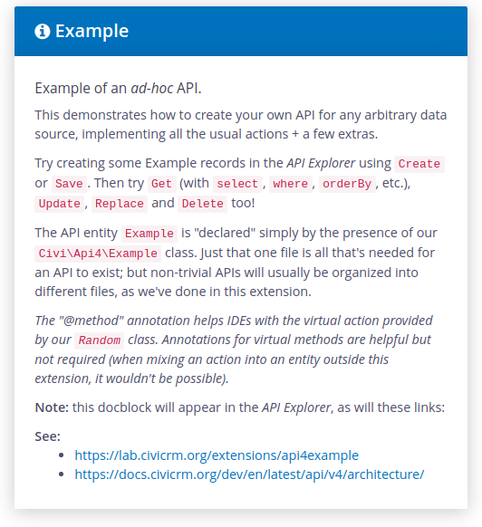

# CiviCRM Api4 Example

#### Code examples to supplement the [APIv4 Architecture](https://docs.civicrm.org/dev/en/latest/api/v4/architecture/) documentation.

This extension declares an APIv4 entity named `Example`. It is a simple but fully-functional api which reads & writes test data from a json file.

The thoroughly commented code demonstrates how to create your own api for any arbitrary data source,
with examples and documentation for implementing all the standard actions.

It also shows how your extension can add new actions to existing entities.

To get started:

  - Install this extension.
  - Visit the Api4 Explorer.
  - Select the `Example` entity.
  - Read the help text and try out the various actions (they really work!).

-----

This extension licensed under [AGPL-3.0](LICENSE.txt).
