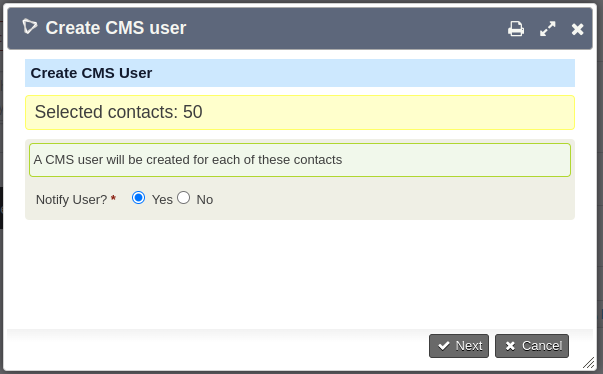

# cmsuser

## Features

### This provides the following CiviRules entities:

- Condition: "Contact has CMS user".
- Action: "Create CMS User". *CMS username is set to contact email address*.

### This provides the following API3 functions:
- `Cmsuser.create` to create a CMS user for a contact.
    - Returns ['uf_id' => {CMS USER ID}, 'created' => TRUE|FALSE]
    - `created` = FALSE if CMS user already existed.
    - Otherwise exception is thrown.
- `Cmsuser.get` to get the CMS user account for a contact.

### Search action and searchKit action:
- Provides an action to bulk "Create CMS user" with optional notify.

The extension is licensed under [AGPL-3.0](LICENSE.txt).

## Installation

See: https://docs.civicrm.org/sysadmin/en/latest/customize/extensions/#installing-a-new-extension

## Release Notes

### 1.4 (2023-12-10)

* Update User create to defer to CMS for password / notify.

### 1.3.1 (2023-12-07)

* Replace deprecated functions.

### 1.3 (2023-08-17)

* Add 'Create CMS User' to searchkittasks.

### 1.2 (2022-06-07)

* Add search task to create CMS user.
