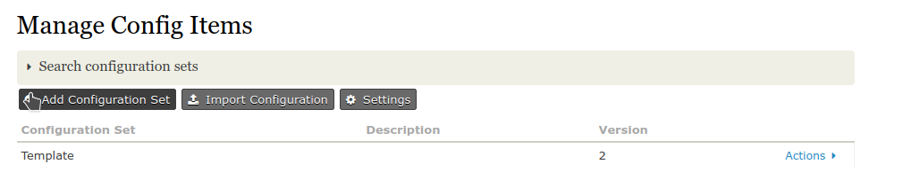
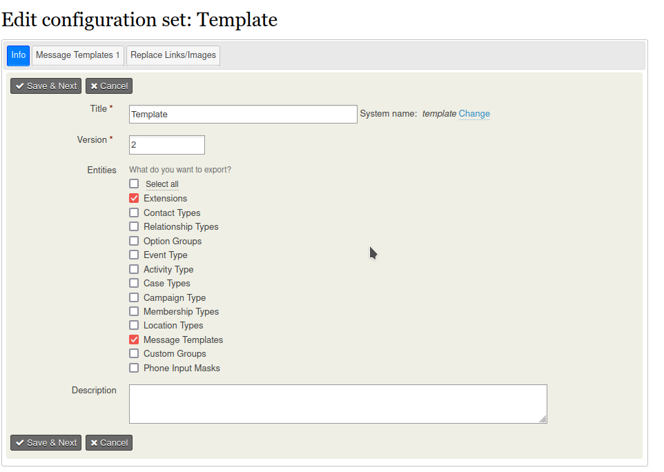

# CiviCRM Configuration Loader extension Version 2

The CiviCRM Configuration Loader extension version 2 lets you export and import configuration sets from CiviCRM into another
CiviCRM installation.

This version is not compatible with version 1.

## Usage

After you have installed this extension you manage import and export files under **Administer** > **System Settings** > **Manage configuration sets**.

## Purpose

* Export configuration from a test system to a live system
* Create configuration files with specific functionality which could be shared within the CiviCRM community.

## Screenshots

# Funded by

* Deutsche Stiftung für Engagement und Ehrenamt
* Bündnis der Bürgerstiftungen Deutschlands,
* civiservice.de GmbH
* CiviCooP

# License

The extension is licensed under [AGPL-3.0](LICENSE.txt).
