# Introduction

With the **CiviCRM Configuration Loader** one can export configuration from an existing system and one can import this
configuration into another system.

This extension is developed with two aims in mind.
Firstly it makes it easier to configure a test system and then copy that configuration into a production system.
Secondly it aims at providing a configuration for certain use cases. Which could then be easily shared within
the community.

!!! tip "Example: Grant Application"
    If your organisation provides grants and you have setup a process for managing the grant application which consists of
    a grant application case type, custom fields on this case type, a form processor for applying for a grant, relationship types
    and message templates.
    You can then export this configuration from your test system, into your production system. And also you can share this
    configuration with the CiviCRM community so that other organisations who have a similar process could reuse your
    configuration.

!!! danger "You still have to do the hard work: Thinking"
    With this extension it is easy to import existing configuration and assume it works in your context.
    However, during a civicrm implementation one of the jobs which require a lot of attention is to make your context clear
    and the problems within your context. As you might guess this extension does not do that job.

# Installation

Download the latest release from https://civicrm.org/extensions/civicrm-configuration-loader-extension-version-2 and upload
it to the extension directory on your CiviCRM server.
Then login into CiviCRM and go to **Administer > System Settings > Extensions** and click on refresh. Then install this extension.

!!! note "Automatic distribution"
    This extension is not available yet for install through CiviCRMs user interface. There is a pending review request
    for this at https://lab.civicrm.org/extensions/extension-review-requests/-/issues/60
    So if you use this extension you might want to review it in that ticket so that it becomes available through _Automatic distribution_.

# Configuration

After you have installed the extension you need to check the configuration.
Go to **Administer > System Settings > Manage Configuration Sets**
and click on **Settings**.

In the settings screen you can set a custom path for `git` and for `composer` both are needed for installing extensions.
By default this extension tries to guess the path to those commands on your server but if it cannot find it you can specify it here.

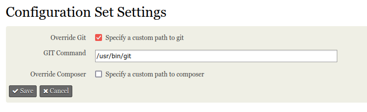

# Import a configuration set

To import a configuration set go to **Administer > System Settings > Manage Configuration Sets**
and then click on **Import Configuration**

In the next screen you can upload a _configuration file_.

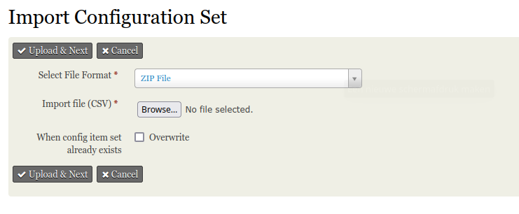

!!! note "Example: Buddy"
    In the `examples` directory you find examples to try out.
    For the next section the example [buddy-v1.zip](./examples/buddy-v1.zip) is used.

Click **Upload & Next** to define what needs to imported. In the screens afterwards you can set what you want to
import and wheter your want to overwrite certain configuration if it already exists. The last step is to import it.

After you have imported a file it is stored under **Administer > System Settings > Manage Configuration Sets** at which
you are able to import it again.

Below screenshots of the [Buddy example](./examples/buddy-v1.zip) import.

**Import contact type configuration**

In the screen for contact type you can skip the creation of the contact type or add it. If the contact type
already exists it will propose to skip it and you will then have an option to overwrite it.

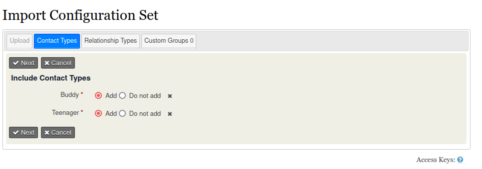

**Import of relationship type configuration**

In the screen for relationship type you can skip the creation of the relationship type or add it. If the relation type
already exists it will propose to skip it and you will then have an option to overwrite it.

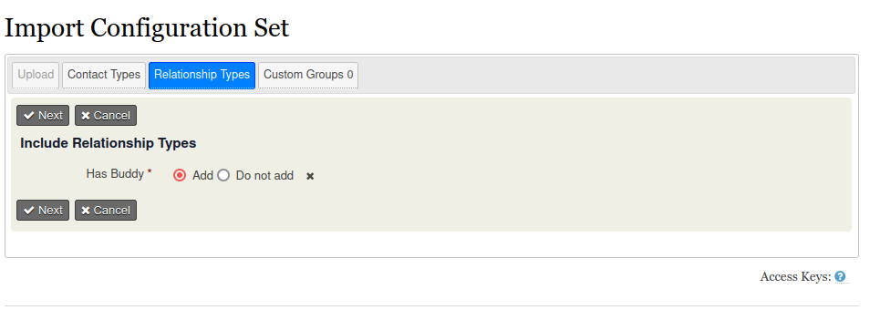

**Import of custom groups and custom fields**

In the screen for custom groups you can define which custom groups you want to add and within each custom group which
custom fields you want to add.
If a custom field already exists it will propose to skip it and you will have the option to overwrite it.
If a custom group already exists it will propose to skip it and you will have an option to overwrite it.

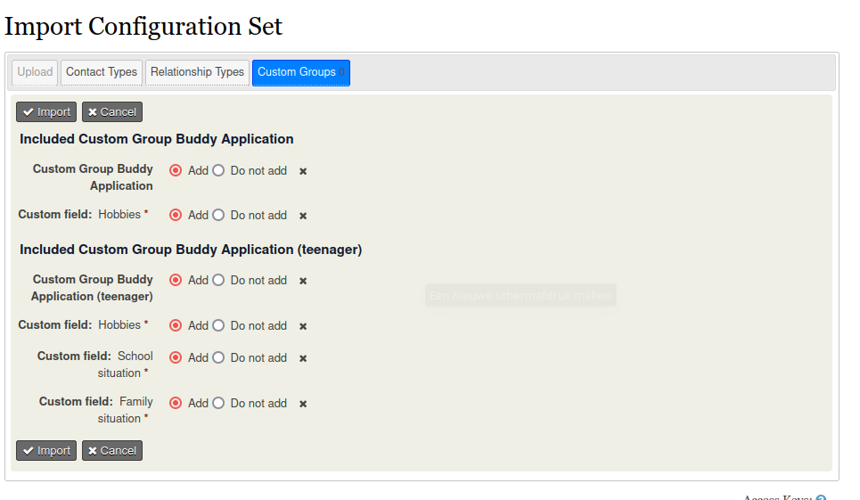

# Create and export a configuration set

To create and export a file you go to **Administer > System Settings > Manage Configuration Sets**.
You then click on **Add configuration set**.

In the next screen you give your set a name, select which entity types you want to export. You can also provide a description
for you configuration set.

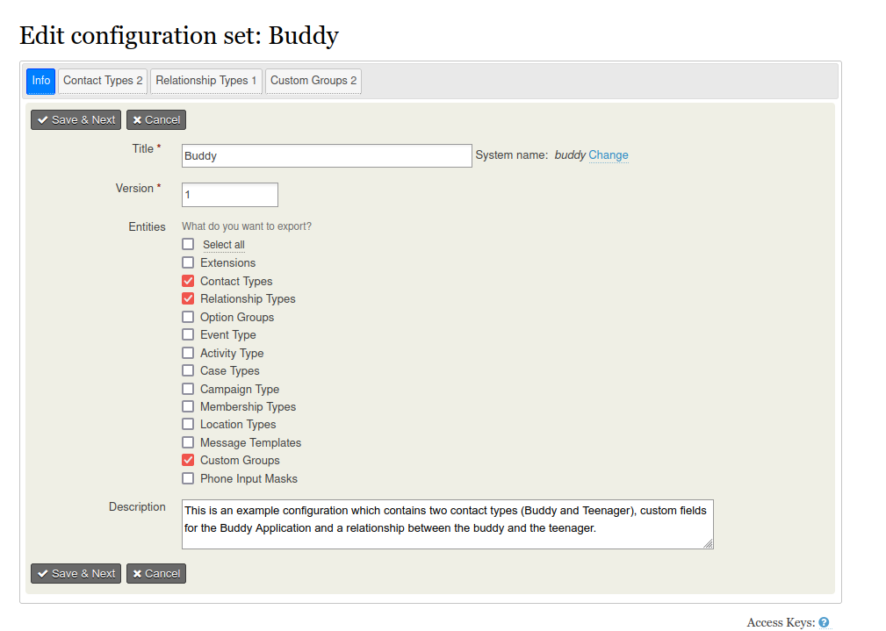

Press **Save & Next** to go the next screen.

!!! note "Example: Buddy"
    Below I explain how I created an export file for a configuration for a buddy for teenager. This consists
    of a contact type for buddy and teenager. Custom fields on both contact types and a relationship type between
    the buddy and the teenager.
    The exported file is [buddy-v1.zip](./examples/buddy-v1.zip)

In the next screen you define which contact types you want to include in the configuration set.

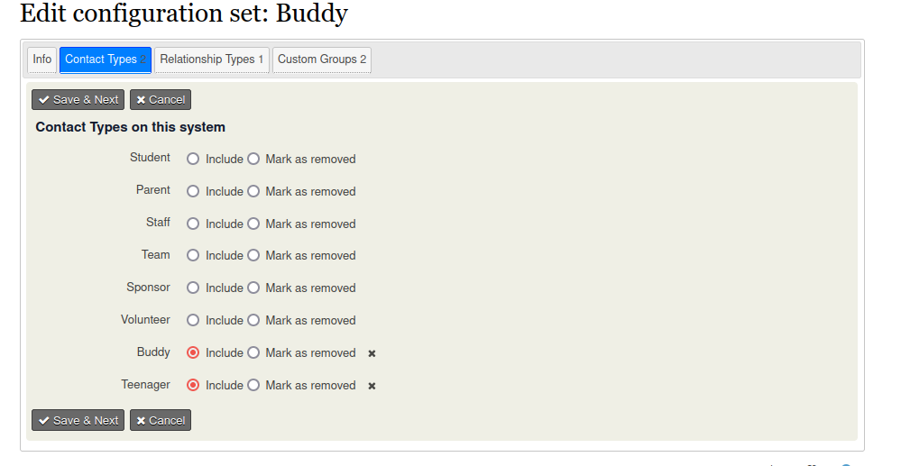

In the next screen you define which relationship type you want to include in the configuration set.

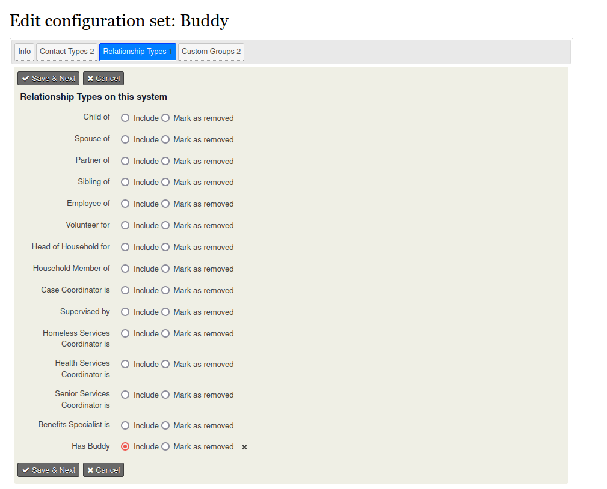

In the next screen you define which custom groups and custom fields you want to include in the configuration set.

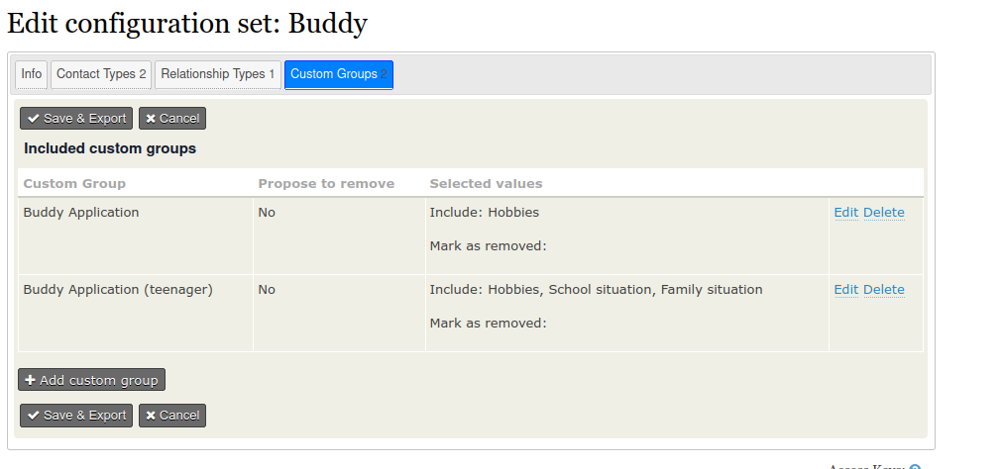

To add a custom group and custom fields click on **Add custom group**. Which leads to the screen where you can define
which custom group you want to add . You can also mark a custom group as removed (this will remove the custom group from the system during import)
You can also define whether you want to include all custom fields, or you can specify the specific custom fields for your export.

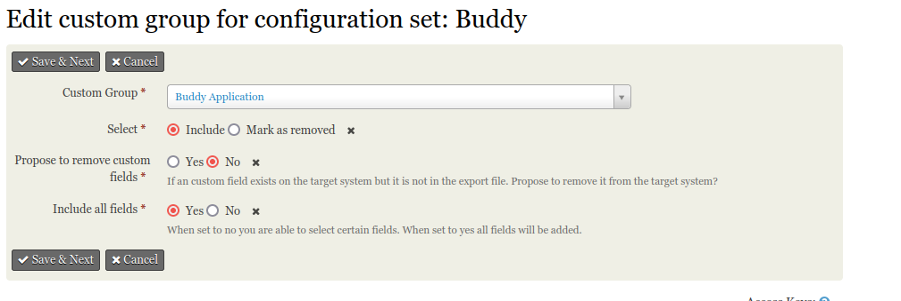

Press **Save & Next** which leads to a screen where you can download the exported file.

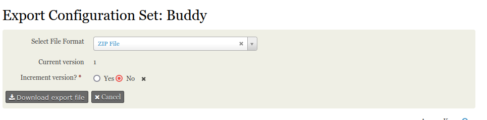

