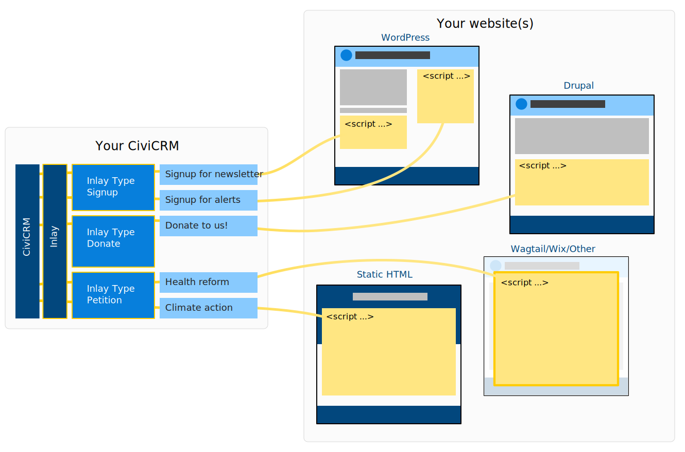
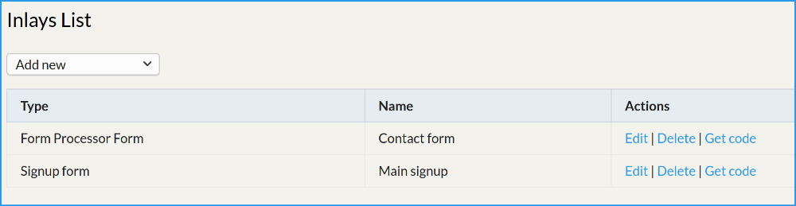

# Inlay

A framework to help CiviCRM extension developers embed functionality on
external websites.

## Introduction for website editors

This technology can help you embed secure interactive widgets in your
external websites that integrate really nicely with your site's design.

This extension does nothing by itself! But other extensions can be built
upon it that provide different *types* of *Inlay*. e.g. one extension
might provide contact forms, another might provide petitions, signup
forms, or a count of affiliated organisations, or a donation form etc.
etc.

You can then create different *instances* of those inlay types. e.g. if
you have an extension that offers petitions, you could create several
petitions. Each instance generates some magic code that you can put on
your website to embed the functionality.

It doesn't matter what technology your external website(s) use, as long as
you are able to add in a `<script>` tag, it will work. If your external
site uses WordPress, there's
a [plugin](https://github.com/artfulrobot/inlay-wp) that lets you insert
inlays using a `[shortcode]`.

Because inlays embed in a site without using iframes, they automatically
inherit the site's style. Website themers may choose to add additional CSS
to further style the embedded content.

## Introduction for Developers

Inlay provides a framework that takes a lot of legwork out of building an
extension to provide embeddable content.

It offers some **security advantages** over some other integration methods
because it allows you to provide a restricted API that only does what it
needs to.

The `<script>` that is embedded in the external site contains config,
a tiny helper, and your extension's Javascipt. Your extension's Javascipt
deals with creating the UI (or, feasibly, any other DOM alterations) and
you can use whatever you want for this (vanilla/Vue/Svelte/React etc.)

The helper code deals with booting your script and provides a means to
send and receive JSON requests to CiviCRM. These requests are handled
first by Inlay, which loads the configuration for the instance and passes
on to your code to do what it will. There's various other helpers for
things like small-time-window CSRF tokens that have proved effective
against spam, and work without annoying or tracking users.

Every cron-run, the inlay scripts are rebuilt. This means you can add in
config and content to the script itself. So if you wanted an inlay that
just listed certain organisations, these could be included in the JS and
therefore rendered quickly, without the need for a further request.

You’ll have realised that CORS must be configured for this to work. Inlay
provides its own implementation of CORS and uses an OptionGroup to store
valid origins for the websites that area allowed to use inlays.

## What Inlay Types are available?

I (Rich / Artful Robot) have written quite a handful of these, and some
other people have been involved in one or two of them.

Here's a list:

- **Signup, Contact** [Source
  code.](https://github.com/artfulrobot/inlaysignup) In the wild: the
  [email box top right of page](https://peopleandplanet.org); or
  see [contact form](https://peopleandplanet.org/contact)

- **Data Wall** [Source
  code](https://github.com/artfulrobot/inlaysignup/blob/private-co/Civi/Inlay/CoDownload.php)
    In the wild: Click the Download button for the [Britain talks climate
    report](https://climateoutreach.org/reports/britain-talks-climate/)

- **Petitions** (high-volume-capable, also doubles as signup form) [Source
  code.](https://github.com/artfulrobot/inlaypetition) In the wild: the
  in-page petition called [Stop the roll out of Integrated Care
  Systems](https://keepournhspublic.com/campaigns/legislative-changes/integrated-care/integrated-care-system-petition/)

- **Grassroots Petitions** - setup template petitions for the public to create
  their own petitions on your site. [Source
  code.](https://github.com/artfulrobot/grassrootspetition) In the wild:
  [peopleandplanet.org](https://peopleandplanet.org/petitions)

- **Form Processor** - add a front-end to the [Form
  Processor](https://lab.civicrm.org/extensions/form-processor/)
  extension. [Source code.](https://lab.civicrm.org/extensions/inlayfp)

- **Hark Surveys** - this allows you to create complex surveys (multi
  section, page, branching, calculated fields...) with multi-user access
  levels to each participant, reporting with tables, charts, CSV
  downloads. [Source code.](https://lab.civicrm.org/extensions/hark.git)

- **Pay** - Stripe and GoCardless, one-off/regular integrated
  payment/donations. [Source
  code.](https://lab.civicrm.org/extensions/inlaypay) In the wild:
  [donate](https://peopleandplanet.org/donate) and another place coming
  soon!

Currently I have written what has been needed to provide specific briefs
from my clients. And therefore most of the Inlays are fairly bespoke, or
opinionated. In many cases I have different branches of the same one,
tailored to a different client's needs.

Inlay types can therefore be:

- Very generic; could be of general use to many orgs.

- Forked or hooked; maybe you took an existing contact form and forked it
  and tweaked it for your client's needs, or you took one and used its
  hooks to implement your own specific needs.

- Entirely bespoke

!!! warning "What you probably want to read here is:"
    There's already an inlay that does exactly what you want, looks exactly
    how you want, and contains every possible combination of features you ever
    dreamt of, and you can install it right now in two clicks!.

    Sorry to bring you down to Earth: that's unlikely.

The reality is that even simple things (e.g. newsletter signup form)
quickly get complex, and the more complex they get the less likely one
style/layout/UX will suit everyone. Part of the beauty is that this
technology can be used to make UXes that fit really well and do exactly
what you need, and using Inlay can massively reduce the development bill
while also providing a centralised admin interface so users have less to
learn.

I'm very [interested](discussion/signup.md) in building generic Inlay types,
especially those that offer hooks for customisations, as these could offer
a super-fast, no- or low-code route to really nice integrations.

We built the [form processor
inlay](https://lab.civicrm.org/extensions/inlayfp) as an attempt at
something generic.

**All ideas, code and funding are welcome.**

But take the example of a "simple" signup form:

- What details do you need? Some orgs want organisation, phone;
  others don't.

- What about GDPR/local privacy laws? Do we need to record acceptance of
  data policy and acceptance or not of consent in some way? How? Do we
  need to support the GDPR extension? What combination of options and
  defaults and UXes do we need to offer, and how does that then affect
  storing/procesing consent?

- What does sign up mean? Does it mean added to a particular group? Or
  perhaps several groups? Or perhaps it means putting them on a [Chassé
  supporter journey](https://github.com/artfulrobot/chasse). Or make an
  API request to a hideous and barely legal marketing company?

- What about storing where the signup came from? Do we want to include
  `utm_*` marketing data in a source field? Or know which webpage the form
  was used on?

- Do we want to send a thank you?

- What does the form look like? Is it static, or does it pop up on exit
  intent or some other trigger?

In my experience with my ten or so clients, everybody wants something
different. Inlay can help developers deliver that fast. Maybe one day
someone will create an inlay with all of the possible options available
that anyone would ever want -- but I'll bet that then staff are
overwhelmed and not confident to use it, and *then* someone will still
want something extra!

See [discussion of generic signup requirements](discussion/signup.md)

## Develop an inlay

You need to implement an admin interface for your Inlay type that offers
configuration options for the instances. I've used AngularJS for mine
to-date but you could use QuickForm if you love that 90s feel, or
something else.

You need to choose a front-end framework (or none) for your front-end UX.
e.g. I've used vanilla JS (compiled with Laravel Mix) for the signup form
and VueJS for the FormProcessor. You could use React, Svelte or whatever
the latest shiny thing is.

You must provide a boot function which will be called with the init data
and a helper `inlay` object that includes a `inlay.request()` method that
you must use for all requests to CiviCRM. How those are processed at the
Civi end is up to you, too.

You must write a class that extends `Civi\Inlay\Type`, and register that.
This is what handles all your requests. I'd suggest you look at some of
the existing inlays for a nice pattern to copy.

Note: the inlay bundles (the .js file that gets embedded) is recreated
every cron run (assuming enabled), and every time the inlay instance data
is edited. You can trigger this manually using the Api4
`Inlay.createBundle` action, too, optionally specifying the inlay ID. Note
that the browser console shows when the bundle was created.

A good starting point would be to look at the inlaysignup extension. That
contains a few inlay types in one place (also check the branches for other
examples) but of note:

- [`Civi\Inlay\InlaySignup`](https://github.com/artfulrobot/inlaysignup/blob/main/Civi/Inlay/InlaySignup.php)
- [registering the inlay types in `hook_civicrm_container`](https://github.com/artfulrobot/inlaysignup/blob/main/inlaysignup.php#L13)
- [signup.js](https://github.com/artfulrobot/inlaysignup/blob/main/src/signup.js)

## Developer: notes on small-time-window CSRF facility.

This is here for you to use when
developing a new Inlay, but you don't have to. It's configurable, so
you can make your token relate to certain data and be valid for
a certain time-window. You could choose to grab a token in the
background as soon as the script loads, which would then be roughly
equivalent to a normal form (but suffers the same security issues
- easy to steal token and use it off-site). Both the the example Inlays
above use the following invisible an anti-spam technique that ensures
each token can only be used once; does not place any load on the server
until form submission and at the very least slows spammers:

1. The initial data submission is validated, errors returned to user if
   invalid.

2. If valid a token is generated that will only match the exact data
   submitted, and is only valid for a time window of 5s time to 2m time.
   submit

3. Javascipt causes a 5s wait for the token to become valid, meanwhile
   a progress bar continues to move along to assure the user this is all
   working. Then it resubmits the data with the token.

4. The data and token are validated. If successful, the real processing is
   done.

5. A response (success/fail) is returned.

## Documentation is (to be) split between the following types

- **Tutorials**: how to do simple things, prescriptive, step by step,
  learning focussed.

- **How-to**: guiding someone to solve a problem they know how to
  articulate or search via a keyword. Narrow and focussed.

- **Reference**: is written plainly about what is available and how to
  work with it. APIs etc.

- **Explanation** (discussion): educates users on the place and situation
  of technology and why it is in use and available.
